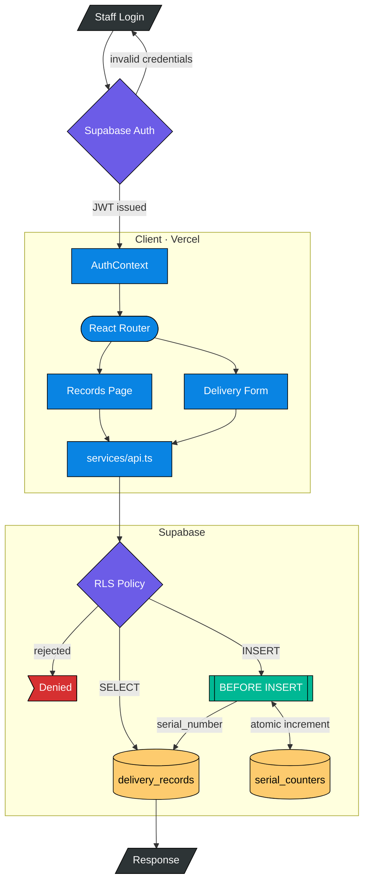

# Hospital Delivery Records System


A browser-based records management system for small private gynaecology hospitals. It replaces paper delivery registers with a searchable, multi-tenant database. Access controls are enforced at the database level using PostgreSQL Row Level Security, so each hospital's records are isolated without any application-layer filtering logic.

## Preview

*Add `docs/screenshots/records-table.png` — records table with serial numbers and search controls.*

*Add `docs/screenshots/new-record.png` — new record form with patient details and delivery fields.*

## Architecture



There is no separate backend server. The React application calls Supabase directly via the official JavaScript client. RLS policies guarantee that a query from one hospital cannot return another hospital's records. Serial numbers are generated by a `SECURITY DEFINER` PostgreSQL trigger in `YYYY-MM-DD-NNN` format, resetting daily per hospital.

## Features

- Email/password authentication via Supabase Auth, with persistent sessions
- Create delivery records: patient name, age, address, Aadhaar last 4, delivery date and time, baby sex, delivery type
- Serial numbers auto-generated by a PostgreSQL trigger (`YYYY-MM-DD-NNN`, e.g. `2026-05-05-001`)
- View all records in a sortable table with a record detail modal
- Advanced search by patient name, Aadhaar last 4, serial number, date, delivery type, and baby sex
- Multi-tenant isolation: each hospital's data is invisible to all other hospitals at the database level
- License tiers (`free`, `basic`, `premium`) modelled on the `hospitals` table for future feature gating

## Tech Stack

| Layer | Technology |
|---|---|
| Frontend | React 18, TypeScript 5.3, Vite 5 |
| Styling | Tailwind CSS 4 |
| Routing | React Router v7 |
| Database + Auth | Supabase (PostgreSQL 15, Supabase Auth) |
| Hosting | Vercel |

## Prerequisites

- Node.js 18 or later
- A free [Supabase](https://supabase.com) account
- A free [Vercel](https://vercel.com) account (for deployment only)

## Getting Started

**1. Clone the repository**

```bash
git clone https://github.com/aniketqxp/hospital-delivery-system.git
cd hospital-delivery-system
```

**2. Install dependencies**

```bash
cd frontend && npm install
```

**3. Provision the database**

Create a new project at [supabase.com](https://supabase.com), open the SQL Editor, and run the full schema:

```bash
cat supabase/schema.sql
```

After the schema is applied, create the first user in **Authentication > Users > Add user**, then link them to a hospital in the SQL Editor:

```sql
INSERT INTO hospitals (name) VALUES ('Your Hospital Name') RETURNING id;

INSERT INTO user_profiles (id, hospital_id, display_name)
VALUES ('<auth-user-uuid>', '<hospital-uuid>', 'Staff Name');
```

**4. Configure environment variables**

```bash
cp frontend/.env.example frontend/.env
```

Edit `frontend/.env` with values from **Supabase Dashboard > Settings > API**:

```
VITE_SUPABASE_URL=https://<project-ref>.supabase.co
VITE_SUPABASE_ANON_KEY=<your-anon-key>
```

**5. Start the development server**

```bash
npm run dev
```

The app is available at `http://localhost:3000`.

## Deployment

`frontend/vercel.json` includes a catch-all rewrite rule for SPA routing. To deploy via the Vercel dashboard:

1. Import this repository at [vercel.com/new](https://vercel.com/new)
2. Set the **Root Directory** to `frontend`
3. Add `VITE_SUPABASE_URL` and `VITE_SUPABASE_ANON_KEY` under **Settings > Environment Variables**
4. Deploy

To deploy via the CLI: `./scripts/deploy.sh`

## Project Structure

```
hospital-delivery-system/
├── frontend/                  # React + Vite application
│   ├── src/
│   │   ├── components/        # UI components grouped by domain
│   │   ├── contexts/          # AuthContext (session + hospital profile)
│   │   ├── hooks/             # useDeliveries data-fetching hook
│   │   ├── lib/               # Supabase client initialisation
│   │   ├── pages/             # Page components wired to routes
│   │   └── services/          # All Supabase CRUD and search operations
│   ├── .env.example
│   └── vercel.json
├── shared/
│   └── types.ts               # TypeScript types shared across the project
├── supabase/
│   └── schema.sql             # Full database schema (run in Supabase SQL Editor)
├── scripts/                   # Shell scripts for dev, build, deploy, and test
└── docs/                      # Additional documentation
```

## License

MIT. See [LICENSE](LICENSE).
